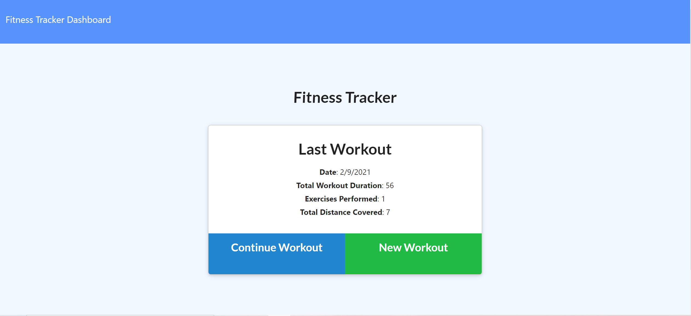
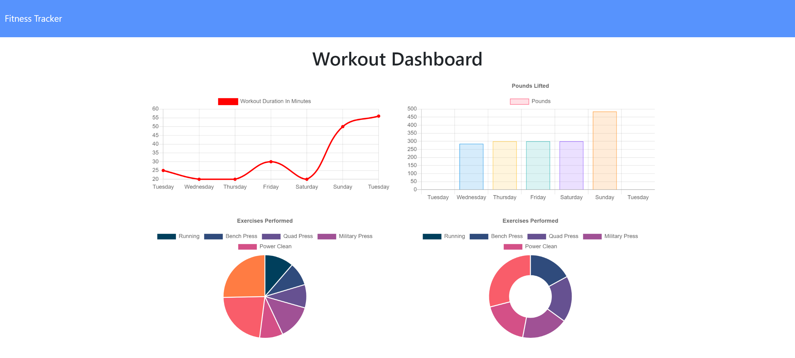
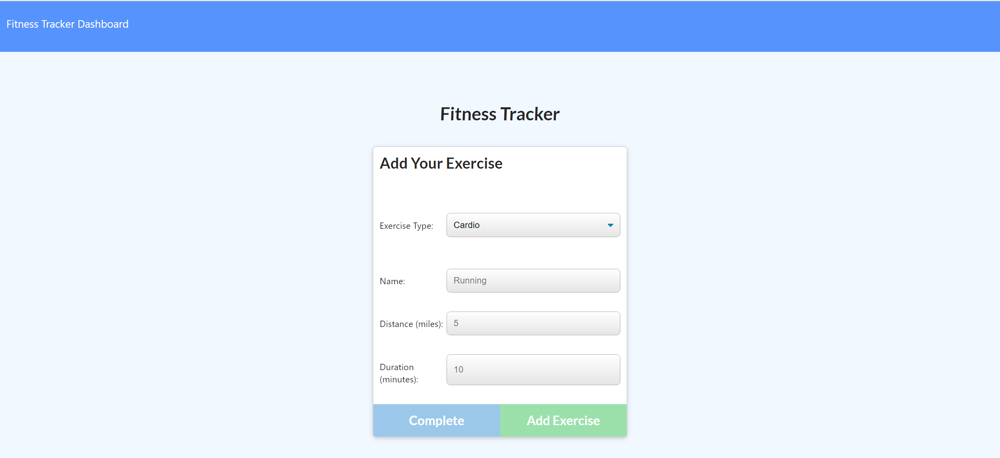

# Fitness Tracker

## Description

This application is fitness tracker the allows the user to:

1. View, create, and track daily workouts.
2. To log multiple exercises in a workout on a given day.
3. Track the name, type, weight, sets, reps, and duration of exercise.
4. Track distance traveled for cardio exercises.

This application utilizes the following packages:

- node & express, to set up our backend server and create routes
- mongodb, database
- mongoose, database odm

### Fitness Application:

Start:

Dashboard:

Update Exercise:

## Table of Contents

- [Installation](#Installation)
- [Usage](#Usage)
- [License](#License)
- [Contributing](#Contributing)
- [Tests](#Tests)
- [Questions](#Questions)

## Installation

To install this application locally clone the repository located at the Github profile in the [Questions](#Questions) section. Additionally, you will need to install the following:

1. [**node.js**](https://nodejs.org/en/)
2. [**express.js**](https://expressjs.com/)
3. [**mongoose**](https://mongoosejs.com/)
4. [**mongodb**](https://www.mongodb.com/)

Once all of these are installed you will be able to use the application from the command line using node.js.

## Usage

In this current release users are only able to:

1. View, create, and track daily workouts.
2. To log multiple exercises in a workout on a given day.
3. Track the name, type, weight, sets, reps, and duration of exercise.
4. Track distance traveled for cardio exercises.

## License

## Contributing

This Team Generator was created by [**Jason Richards**](https://github.com/jrkrichards).

## Tests

This release utilize Jest to test the application.

## Questions

Github: https://github.com/jrkrichards
